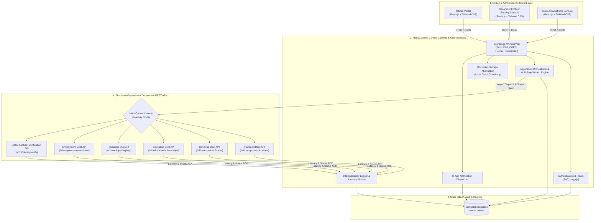

# MahaConnect — Government Platform Interoperability System

> **BSc IT FSDM (Full Stack Development & Management) Capstone Project**  
> *A Unified Citizen-Facing Platform & Interoperability Gateway for Maharashtra State Digital Services*

---

## 1. Project Overview

**MahaConnect** is a next-generation electronic governance platform engineered to eliminate siloed departmental portals. Instead of citizens repeatedly re-registering and submitting duplicative identity proofs across isolated departments, MahaConnect provides a **single citizen profile and unified service gateway**.

The platform is designed to establish interoperability across multiple state departments:
- **Transport Department (Motor Vehicles / RTO)** — Sarathi / Vahan integration
- **Revenue & Land Records Department** — Tahsil & e-District integration
- **Higher & Technical Education Department** — MahaDBT Scholarship gateway
- **Municipal Corporation & Urban Development** — Civil Registry (Birth/Property)
- **Skill Development & Employment Department** — MahaSwayam Exchange
- **Social Justice & Special Assistance Department** — Welfare schemes
- **Public Health Department** — Universal health protection schemes

Every application dispatch and status modification is routed through a simulated **Government Interoperability REST Gateway** with latency calculation, status validation, and detailed transaction audit logging.

---

## 2. System Architecture

### Interoperability Architecture Flow (Mermaid Diagram)



---

## 3. Technology Stack

| Layer | Technologies Used | Description |
|---|---|---|
| **Frontend** | React 18, Vite 6, Tailwind CSS 3, React Router v6, Axios, Lucide React Icons | Modern, accessible, responsive e-Governance UI with deep blue, white, and saffron/green accents |
| **Backend** | Node.js, Express.js 4, RESTful APIs | Modular MVC architecture with controllers, services, middleware, and routers |
| **Authentication** | JWT (JSON Web Tokens), bcryptjs | Secure password hashing (10 salt rounds), stateless Bearer authentication, and Role-Based Access Control (RBAC) |
| **Database** | MongoDB 8, Mongoose ODM 8 | Document-oriented storage with indexing, aggregation pipelines, and embedded schemas |
| **Interoperability** | Simulated REST Microservices Layer | Real-time simulated external API dispatch, latency simulation (30ms–110ms), and transaction logging |
| **File Storage** | Multer disk storage + Cloudinary support | Storage abstraction defaulting to local disk (`server/uploads/`) with static serving |
| **Security** | Helmet, CORS, Express-Rate-Limit, Input Sanitization | HTTP header hardening, rate limiting (1000 requests/15m), and MIME validation |

---

## 4. Key Modules & Features

### 4.1 Citizen Module
- **Single Citizen Profile**: Pre-filled demographic info (Name, DOB, Gender, Mobile, Email, Residential Address).
- **Service Catalog**: Searchable and filterable by department and category (Licences, Certificates, Education, Property, Employment, Welfare, Health).
- **5-Step Application Wizard**:
  1. Personal Information verification
  2. Dynamic Service-Specific Fields
  3. Document Upload (PDF, PNG, JPG with size/type validation)
  4. Review & Confirmation
  5. Submission -> Instant generation of unique Application ID (e.g. `MC-2026-000101`) + Print Acknowledgement receipt.
- **Application Tracking**: Chronological visual timeline displaying each departmental milestone, timestamp, actor, and officer remarks.
- **Notifications**: Real-time notifications bell with unread badge and direct application links.

### 4.2 Department Officer Module
- **Officer Scrutiny Console**: Filtered to the officer's assigned department (e.g., Transport or Revenue).
- **KPI Metrics**: Total department submissions, pending scrutiny, clarifications needed, and approved certificates.
- **Scrutiny Dossier**: Full view of citizen data, dynamic form parameters, and uploaded documents with download/inspection links.
- **Status Decision Panel**: Allows changing status to `Under Review`, `Additional Information Required`, `Approved`, `Rejected`, or `Completed` with remarks, which triggers an automated Interoperability API sync and citizen notification.

### 4.3 State Administrator Module
- **System Overview & Analytics**: Aggregated KPIs across all citizens, officers, departments, and applications with visual status and department distribution charts.
- **Department Management (CRUD)**: Create, edit, activate/deactivate participating departments, configure REST endpoints and SLAs.
- **Service Management (CRUD)**: Add services with dynamic form fields, required document lists, and processing fee.
- **User Management**: Filter by role, activate/deactivate user accounts, recruit and assign new Department Officers.
- **Statewide Applications Ledger**: Universal filterable view of all service requests across Maharashtra.
- **Interoperability & API Gateway Activity Logs (`/admin/api-logs`)**:
  - Live table of inter-system REST calls: `Timestamp`, `Source`, `Destination`, `Endpoint`, `Method`, `HTTP Status`, `Latency (ms)`, `Result`.
  - Interactive **JSON Payload Inspector Modal** showing full request and response payloads.

---

## 5. Folder Structure

```
MahaConnect/
│
├── client/                     # Frontend Application (React + Vite)
│   ├── public/
│   ├── src/
│   │   ├── api/                # Axios instance & interceptors
│   │   │   └── axios.js
│   │   ├── components/         # Shared & Layout components
│   │   │   ├── common/         # StatusBadge, LoadingSkeleton, EmptyState, ProtectedRoute
│   │   │   └── layout/         # Navbar, Sidebar, Footer, DashboardLayout
│   │   ├── context/            # AuthContext & ToastContext
│   │   │   ├── AuthContext.jsx
│   │   │   └── ToastContext.jsx
│   │   ├── pages/
│   │   │   ├── admin/          # Admin views (Dashboard, Departments, Services, Users, Logs)
│   │   │   ├── auth/           # Login, Register, ForgotPassword, ResetPassword
│   │   │   ├── citizen/        # Dashboard, Services, ApplyService, Tracking, Profile
│   │   │   ├── officer/        # OfficerDashboard, ScrutinyQueue, OfficerReview
│   │   │   └── public/         # LandingPage
│   │   ├── App.jsx             # Main Router & Role Guards
│   │   ├── index.css           # Tailwind directives & theme
│   │   └── main.jsx
│   ├── index.html
│   ├── package.json
│   ├── tailwind.config.js
│   └── vite.config.js
│
├── server/                     # Backend Application (Node.js + Express)
│   ├── config/
│   │   └── db.js               # MongoDB Connection Handler
│   ├── controllers/            # Controller logic for all entities
│   │   ├── analyticsController.js
│   │   ├── apiLogController.js
│   │   ├── applicationController.js
│   │   ├── authController.js
│   │   ├── departmentController.js
│   │   ├── notificationController.js
│   │   ├── serviceController.js
│   │   └── userController.js
│   ├── middleware/             # Auth, RBAC, Multer upload, Error handling
│   │   ├── auth.js
│   │   ├── errorHandler.js
│   │   ├── role.js
│   │   └── upload.js
│   ├── models/                 # Mongoose Data Models
│   │   ├── ApiLog.js
│   │   ├── Application.js
│   │   ├── Department.js
│   │   ├── Notification.js
│   │   ├── Service.js
│   │   └── User.js
│   ├── routes/                 # Express REST Endpoints
│   ├── seed/
│   │   └── seed.js             # Comprehensive Database Seeder
│   ├── services/               # Core business services
│   │   ├── interopService.js   # Simulated Department REST Gateway & Logger
│   │   ├── notificationService.js
│   │   └── storageService.js   # Local/Cloudinary storage abstraction
│   ├── test/
│   │   └── integration_test.js # Automated End-to-End Test Suite
│   ├── uploads/                # Local uploaded documents storage
│   ├── .env                    # Active environment configuration
│   ├── .env.example            # Environment template
│   ├── app.js                  # Express App configuration
│   ├── package.json
│   └── server.js               # Server Entrypoint
│
├── package.json                # Root package for unified scripts
├── README.md                   # Complete Project Documentation
└── .gitignore
```

---

## 6. Installation & Setup

### Prerequisites
- **Node.js**: v18+ (tested on Node.js v24)
- **npm**: v9+ (tested on npm 11)
- **MongoDB**: Community Server running locally on port `27017` (or MongoDB Atlas URI)

### Step 1: Clone or Navigate to the Project
```bash
cd /Users/quick/Desktop/MahaConnect
```

### Step 2: Install Dependencies
You can install dependencies for both `server` and `client` in one command:
```bash
npm run install:all
```
*Or individually:*
```bash
cd server && npm install
cd ../client && npm install
```

### Step 3: Configure Environment Variables
The server `.env` is pre-configured with default local settings:
```env
PORT=5000
NODE_ENV=development
MONGODB_URI=mongodb://127.0.0.1:27017/mahaconnect
JWT_SECRET=mahaconnect_super_secret_jwt_key_2026_academics
JWT_EXPIRE=7d
CLIENT_URL=http://localhost:5173

# Optional: Cloudinary (leave empty to use local server/uploads/)
CLOUDINARY_CLOUD_NAME=
CLOUDINARY_API_KEY=
CLOUDINARY_API_SECRET=
```

### Step 4: Seed the Database
Populate demo users, departments, dynamic services, sample applications with full timelines, notifications, and interoperability logs:
```bash
npm run seed
```
*(Runs `node server/seed/seed.js`)*

---

## 7. Running the Application

### Running Backend Server
```bash
npm run server
```
*The server will start on `http://localhost:5000`.*  
Health check endpoint: `http://localhost:5000/api/health`

### Running Frontend Client
In a separate terminal:
```bash
npm run client
```
*The Vite development client will start on `http://localhost:5173`.*

Open your browser and navigate to:  
👉 **`http://localhost:5173`**

---

## 8. Demo Login Credentials

The login page (`/login`) includes **1-Click Autofill Buttons** for immediate presentation:

| Role | Email Address | Password | Responsibilities |
|---|---|---|---|
| 👤 **Citizen** | `citizen@demo.com` | `Password123!` | Browse services, apply, upload documents, track timeline, view notifications |
| 👮 **Transport Officer** | `officer@demo.com` | `Password123!` | Review Transport Department applications, inspect docs, approve/reject/request info |
| 👮 **Revenue Officer** | `revenue.officer@demo.com` | `Password123!` | Scrutinize Income & Caste certificates for Pune Tehsil |
| 🛡️ **State Admin** | `admin@demo.com` | `Password123!` | Full system control, manage departments & services, recruit officers, inspect live Interop API logs |

---

## 9. Comprehensive API Documentation

All protected endpoints require an `Authorization: Bearer <JWT>` header.

### 9.1 Authentication Endpoints (`/api/auth`)
| Method | Endpoint | Access | Description |
|---|---|---|---|
| `POST` | `/api/auth/register` | Public | Register a new citizen profile |
| `POST` | `/api/auth/login` | Public | Authenticate user & return JWT token |
| `GET` | `/api/auth/me` | Private | Retrieve current authenticated user profile |
| `PUT` | `/api/auth/profile` | Private | Update name, phone, and residential address |
| `PUT` | `/api/auth/change-password` | Private | Verify existing password and save new password |
| `POST` | `/api/auth/forgot-password` | Public | Generate a password reset token |
| `PUT` | `/api/auth/reset-password/:token`| Public | Reset password using valid token |

### 9.2 Department Endpoints (`/api/departments`)
| Method | Endpoint | Access | Description |
|---|---|---|---|
| `GET` | `/api/departments` | Public | List all active departments with service counts |
| `GET` | `/api/departments/:id` | Public | Get single department with associated services |
| `POST` | `/api/departments` | Admin | Create a new department with REST endpoint and contact info |
| `PUT` | `/api/departments/:id` | Admin | Update department parameters |
| `DELETE`| `/api/departments/:id` | Admin | Toggle department active/inactive status |

### 9.3 Service Endpoints (`/api/services`)
| Method | Endpoint | Access | Description |
|---|---|---|---|
| `GET` | `/api/services` | Public | List services with search, department, and category filter |
| `GET` | `/api/services/:id` | Public | Get single service with dynamic schema definition |
| `POST` | `/api/services` | Admin | Add new service with required documents & SLA |
| `PUT` | `/api/services/:id` | Admin | Edit service specifications |
| `DELETE`| `/api/services/:id` | Admin | Toggle service active/inactive status |

### 9.4 Application Workflow Endpoints (`/api/applications`)
| Method | Endpoint | Access | Description |
|---|---|---|---|
| `POST` | `/api/applications` | Citizen | Submit new application & trigger Interop Gateway dispatch |
| `GET` | `/api/applications/my` | Citizen | List applications submitted by current citizen |
| `GET` | `/api/applications/department` | Officer | List applications for officer's assigned department |
| `GET` | `/api/applications/all` | Admin | Universal statewide applications audit list |
| `GET` | `/api/applications/:id` | Authenticated | Retrieve application details, form data, docs, and timeline |
| `PATCH`| `/api/applications/:id/status`| Officer/Admin | Update status, add remarks, append timeline & sync Interop API |
| `POST` | `/api/applications/upload` | Authenticated | Upload verification documents (PDF, JPG, PNG up to 10MB) |

### 9.5 Interoperability Logs & Analytics Endpoints (`/api/api-logs`, `/api/analytics`)
| Method | Endpoint | Access | Description |
|---|---|---|---|
| `GET` | `/api/api-logs` | Admin | Retrieve filterable list of simulated REST transactions |
| `GET` | `/api/api-logs/stats` | Admin | Interoperability KPI metrics (avg latency, success rate) |
| `DELETE`| `/api/api-logs` | Admin | Clear audit logs for maintenance |
| `GET` | `/api/analytics/citizen` | Citizen | Citizen dashboard application metrics |
| `GET` | `/api/analytics/officer` | Officer | Department officer scrutiny queue metrics |
| `GET` | `/api/analytics/admin` | Admin | System-wide analytics, trends, and department distributions |

---

## 10. Automated Testing

MahaConnect includes a built-in automated end-to-end integration test suite verifying the entire system:
```bash
node server/test/integration_test.js
```
The test suite validates:
1. Health check endpoint
2. Department & service catalog retrieval
3. Authentication for all three user roles
4. Citizen application submission with dynamic data
5. Interoperability gateway automatic dispatch
6. Officer review & timeline step appending
7. In-app notification generation
8. API Interoperability audit logging & latency tracking
9. System-wide analytics aggregations

---

## 11. Viva Demonstration Guide (For BSc IT FSDM Presentation)

When demonstrating this project to the external examiner, follow this recommended walkthrough:

### 1. Highlight the Problem Statement & Project Goal
- Explain that citizens currently struggle with fragmented government websites (e.g. separate portals for Transport, Revenue, Education, and Municipal corporations).
- Explain **MahaConnect's Solution**: A unified single-sign-on citizen portal that communicates with simulated departmental backends via a secure **Interoperability Gateway**.

### 2. Walkthrough: The Citizen Journey
1. Open `http://localhost:5173/login` and click **"Citizen (citizen@demo.com)"** to autofill credentials.
2. Sign in to see the **Citizen Dashboard** with application statistics and quick service links.
3. Click **"Government Services"** in the sidebar. Demonstrate filtering by department (Transport, Revenue) or category (Licences, Certificates).
4. Select **"New Driving Licence Application"** and click **Apply Now**.
5. Walk through the 5-step wizard:
   - **Step 1 (Personal Info)**: Point out that demographic data is automatically populated from the verified citizen profile.
   - **Step 2 (Service Info)**: Highlight that these fields (`Learner Licence No`, `Vehicle Class`, `RTO Office`) are **dynamically rendered** based on the service schema.
   - **Step 3 (Document Upload)**: Upload a sample document and point out the file size and type validation.
   - **Step 4 (Review)**: Review all data with edit capability and declaration.
   - **Step 5 (Submit)**: Submit the application. Show the generated unique ID (`MC-2026-XXXXXX`) and the department reference ID.
6. Click **"View Tracking Timeline"** to show the real-time visual milestone steps (`Submitted` → `Department Received`).

### 3. Walkthrough: The Department Officer Review
1. Logout and log in with **"Transport Officer (officer@demo.com)"**.
2. Notice the **Officer Dashboard** showing pending applications specific to the **Transport Department**.
3. Open **"Scrutiny Applications"** to see the newly submitted application in the queue.
4. Click **"Scrutinize"** on the application.
5. In the **Officer Decision Panel**, select **"Mark Under Review"** or **"Approve Application"**, enter remarks (e.g., *"Documents verified against RTO database"*), and click the decision button.
6. Show that the timeline immediately records the officer's name, action, and timestamp.

### 4. Walkthrough: The Administrator & Interoperability Logs (Crucial for FSDM)
1. Logout and log in with **"State Administrator (admin@demo.com)"**.
2. Open the **Admin Dashboard** and demonstrate:
   - Real-time aggregations (Citizens, Officers, Applications by Department).
   - Application distribution charts.
   - Gateway health overview (calls, 100% success rate, average latency in ms).
3. Navigate to **"Interop API Logs" (`/admin/api-logs`)**:
   - **This is the core FSDM demonstration point.**
   - Point out the logged transaction:  
     `MahaConnect Gateway → Transport Department (Vahan/Sarathi API) [POST /v1/transport/applications] (201 Created, ~50ms)`
     `MahaConnect Gateway → Transport Department (Vahan/Sarathi API) [PATCH /status] (200 OK, ~40ms)`
   - Click **"Inspect"** on any log to open the **JSON Payload Inspection Modal**, showing both the outgoing request payload and the simulated department response.

---

## 12. Known Limitations & Future Improvements

### Current Academic Prototype Considerations
- **Simulated Department Endpoints**: Since state government intranets (e.g. Sarathi, MahaBhulekh) do not expose public write APIs to student developers, departmental endpoints are realistically simulated with latency simulation and audit logging.
- **Storage**: Defaulted to local disk storage (`server/uploads/`) so the project runs out-of-the-box on any computer without requiring Cloudinary API keys.
- **Email Delivery**: Password reset returns the reset token directly in the response and UI for hassle-free local viva demonstration without SMTP credentials.

### Suggested Future Enhancements
1. **DigiLocker Direct Fetch**: Connect with the National DigiLocker API to automatically pull certified Aadhaar, 10th/12th marksheets, and driving licenses without manual file uploads.
2. **WebSocket Real-time Timeline**: Implement Socket.io for live milestone animation on the tracking screen without manual page refreshes.
3. **Multilingual Localization**: Add bilingual English and Marathi language toggle for broader accessibility across Maharashtra.
4. **Blockchain Audit Trail**: Store application status hashes on an immutable distributed ledger for tamper-evident public accountability.

---

## 13. License & Academic Attribution
Developed for the **BSc IT Full Stack Development & Management (FSDM)** academic curriculum.  
Licensed under the **MIT License**.
